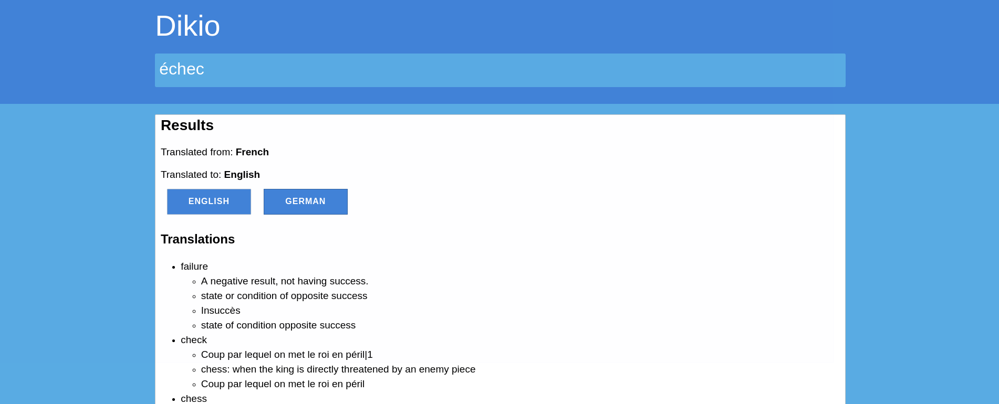

# dikio
Dikio is an self-hosted web application to save words you learn in others languages than your native language: it will be your own dictionary.



## Developers

To build:
```bash
npm run build
```

To develop with watching files:
```bash
npm run watch
```
